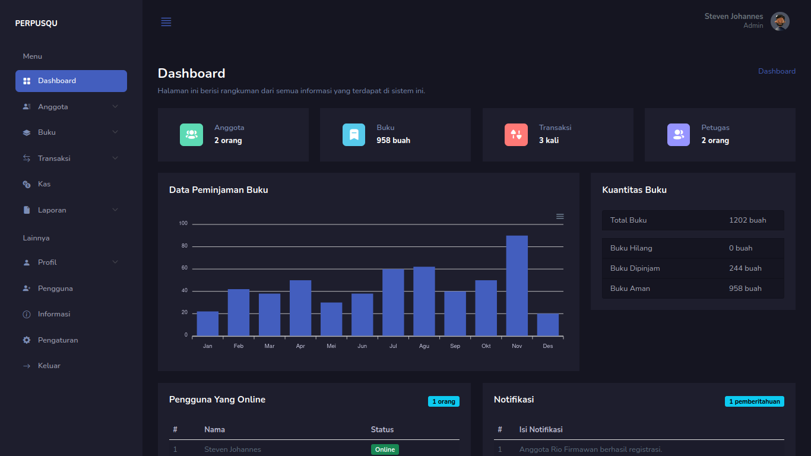

# Perpusqu - Sistem Informasi Perpustakaan Berbasis Web

Website Pengelolaan Perpustakaan dengan 3 role, yaitu :
- Admin
- Petugas
- Anggota

## Table of contents

- [Penjelasan](#penjelasan)
  - [Screenshot](#screenshot)
- [Dibuat Dengan](#dibuat-dengan)

## Penjelasan

### Screenshot

## Dibuat Dengan

- PHP
- Bootstrap
- Mazer Template 
- Javascript
- Illuminate DB, FS, Translation, Validation
- DOMPDF

Segitu aja sih, males jelasin fitur panjang-panjang hehe